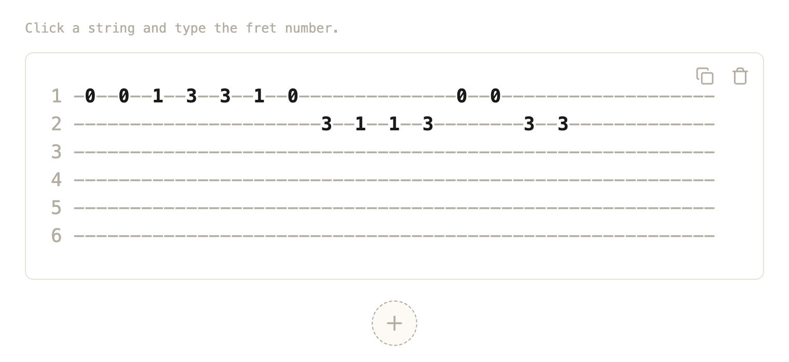

# ascii-tabs

A zero-dependency web component for writing and showing guitar tabs as plain ASCII text.

<a href="https://libasoles.github.io/ascii-tabs/">
  <picture>
    <source media="(prefers-color-scheme: dark)" srcset="docs/img/example-dark.png">
    
  </picture>
</a>

That's one `<ascii-tabs>` element: click a string, type a fret, and copy the result as plain text:

```
1 -0--0--1--3--3--1--0--------------0--0-------
2 ----------------------3--1--1--3--------3--3-
3 ---------------------------------------------
4 ---------------------------------------------
5 ---------------------------------------------
6 ---------------------------------------------
```

**▶ [Try the live demo](https://libasoles.github.io/ascii-tabs/)**: every feature, editable, in your browser.

Design notes: [spec](docs/spec-v0.1.md), [glossary](GLOSSARY.md), [ADRs](docs/adr). `tablatura.html` is the original standalone editor this library grew from.

## Usage

```html
<script type="module" src="https://cdn.jsdelivr.net/gh/libasoles/ascii-tabs@main/ascii-tabs.js"></script>

<ascii-tabs></ascii-tabs>
```

A bare `<ascii-tabs>` is editable: a hint, one Sheet per Tab with copy and delete buttons, and an add button. Click a string and type the fret number (0–24); move with the arrow keys, Enter and Tab.

## Initial value

Pass the content as data through the `value` property. This is the preferred way to fill the element: no parsing, nothing ambiguous, and it is the same shape `value` and `change` give back.

`value` is `(number|null)[][][]`: an array of Tabs, each an array of Columns, each Column 6 entries from String 1 to String 6, a Fret (0–24) or `null` for an empty String.

```html
<ascii-tabs id="song"></ascii-tabs>
<script>
  song.value = [
    [ // one Tab
      [null, null, 2, null, 0, null],
      [null, null, null, 2, null, null],
      [null, 3, null, null, null, null],
      [null, null, 2, null, 0, null],
    ],
  ];
</script>
```

renders as:

```
1 ------------
2 -------3----
3 -2--------2-
4 ----2-------
5 -0--------0-
6 ------------
```

`value` can be set before or after the element upgrades. Read it back the same way; every edit fires `change`:

```js
song.addEventListener('change', e => console.log(e.detail.value));
```

If all you have is ASCII text, put it in a `<pre>` instead (see below).

## ASCII in and out

As an alternative to `value`, a `<pre>` per Tab becomes the initial value; it is ignored when `value` is set. Parsing is lenient: number labels (`1 `–`6 `) and note labels (`e|B|G|D|A|E|`), any number of dashes. Frets at the same horizontal position share a Column, and several Staves are joined into one Tab.

```html
<ascii-tabs>
  <pre>
1 ---------
2 ---------
3 -2---2---
4 ---------
5 -0---0---
6 ---------</pre>
  <pre>
e|-0--3--|
B|-1--0--|
G|-0--0--|
D|-2--0--|
A|-3--2--|
E|-----3-|</pre>
</ascii-tabs>
```

The copy button copies the same plain ASCII. `parse` and `format` are exported as pure functions:

```js
import { parse, format } from './ascii-tabs.js';

const tab = parse('1 -3--5-\n2 ------\n3 ------\n4 ------\n5 ------\n6 ------'); // one Tab: Column[]
format(tab, { spacing: 2 }); // "1 -3--5-\n2 ------\n..."
```

`format` writes number labels, Spacing 2 by default, widens a Column that holds a two-digit Fret on every String, and cuts each Staff right after its last Column. Malformed ASCII logs a console error and parses to an empty Tab.

## Composition

Features are turned on by composing parts, not by boolean attributes ([ADR 0001](docs/adr/0001-composition-over-boolean-props.md)). With no part children you get the default composition: hint, a Sheet with copy and delete, and add (read-only: just a Sheet with copy). With any part child, only the parts you declare appear. Content inside a part replaces its default icon or text.

```html
<ascii-tabs>
  <ascii-tabs-hint></ascii-tabs-hint>
  <ascii-tabs-sheet>
    <ascii-tabs-copy></ascii-tabs-copy>
    <ascii-tabs-delete></ascii-tabs-delete>
  </ascii-tabs-sheet>
  <ascii-tabs-add></ascii-tabs-add>
</ascii-tabs>
```

### Read-only

```html
<ascii-tabs id="song" readonly></ascii-tabs>
<script>
  song.value = [[[3, null, null, null, null, null]]];
</script>
```

`readonly` disables editing. Hint, delete and add hide themselves even when declared; copy still works.

### Copy, hint, add and delete

```html
<!-- No copy button -->
<ascii-tabs><ascii-tabs-sheet></ascii-tabs-sheet></ascii-tabs>

<!-- Custom copy text, custom hint -->
<ascii-tabs>
  <ascii-tabs-hint>Pick a string, then type a fret.</ascii-tabs-hint>
  <ascii-tabs-sheet><ascii-tabs-copy>Copy ASCII</ascii-tabs-copy></ascii-tabs-sheet>
  <ascii-tabs-add>+ New tab</ascii-tabs-add>
</ascii-tabs>
```

Delete never asks for confirmation. With several Tabs it removes its Tab; with one Tab it clears it, and is disabled while that Tab is empty.

### Custom controls

Skip the parts and call the root's methods:

```html
<ascii-tabs id="tabs"></ascii-tabs>
<button onclick="tabs.copy(0)">Copy</button>
<button onclick="tabs.addTab()">Add</button>
<button onclick="tabs.removeTab(0)">Delete</button>
```

`copy(index)`, `addTab()` and `removeTab(index)` behave like the built-in buttons, including the delete rules.

## Spacing

Spacing is the number of dashes between two Columns' Frets: `spacing="N"` (1–6, clamped, default 2), also available as the `spacing` property. Add the optional slider part to let people change it; it is not in the default composition and also works in `readonly`. Spacing changes the rendered Tab and the copied text, and a Column with a two-digit Fret is still one character wider on every String.

```html
<!-- Initial spacing, no slider -->
<ascii-tabs spacing="3"></ascii-tabs>

<!-- Slider from 1 to 6 (put text inside to replace its label) -->
<ascii-tabs>
  <ascii-tabs-spacing></ascii-tabs-spacing>
  <ascii-tabs-sheet><ascii-tabs-copy></ascii-tabs-copy></ascii-tabs-sheet>
</ascii-tabs>
```

## String labels

Strings are labelled `1`–`6` by default, on screen and in copied text. `labels="notes"` names them in standard tuning (`e B G D A E`, String 1 to 6). Parsing accepts both styles whatever the attribute says.

```html
<ascii-tabs></ascii-tabs>                  <!-- 1 -3--5- -->
<ascii-tabs labels="notes"></ascii-tabs>   <!-- e|-3--5- -->
```

## Themes

The element renders in the light DOM ([ADR 0002](docs/adr/0002-light-dom.md)) and paints only its Sheets, never the page background. Without `theme` it follows `prefers-color-scheme`; `theme="light"` or `theme="dark"` forces a palette. Every colour is a custom property you can override on the element or any ancestor:

| Property | Light | Dark |
|---|---|---|
| `--ascii-tabs-paper` | `#fdfaf5` | `#1b1a18` |
| `--ascii-tabs-sheet` | `#fff` | `#232220` |
| `--ascii-tabs-ink` | `#1a1a1a` | `#f1ede4` |
| `--ascii-tabs-dash` | `#6f6c66` | `#959189` |
| `--ascii-tabs-line` | `#e7e2d6` | `#36342f` |
| `--ascii-tabs-hover` | `#f4efe4` | `#2c2a27` |
| `--ascii-tabs-focus` | `#f6e4df` | `#3a2a1d` |
| `--ascii-tabs-accent` | `#8b0000` | `#fb923c` |

`--ascii-tabs-font` and `--ascii-tabs-font-size` set the typography.

```html
<ascii-tabs></ascii-tabs>                      <!-- auto -->
<ascii-tabs theme="light"></ascii-tabs>
<ascii-tabs theme="dark"></ascii-tabs>
<ascii-tabs style="--ascii-tabs-accent: teal; --ascii-tabs-sheet: #f0fafa"></ascii-tabs>
```

## Text

Built-in text is English. `lang="es"` switches every built-in string to Spanish. The `messages` property takes a partial object that is merged over the active language; content you put inside a part still wins over `messages`.

```html
<ascii-tabs></ascii-tabs>               <!-- "Click a string and type the fret number." -->
<ascii-tabs lang="es"></ascii-tabs>     <!-- "Hacé clic en una cuerda y escribí el número de traste." -->

<ascii-tabs id="tabs"></ascii-tabs>
<script>
  tabs.messages = { hint: 'Tap a string, then type a fret.', copy: 'Copy as ASCII' };
</script>
```

Keys: `hint`, `copy`, `copied`, `delete`, `add`, `fret`, `spacing`.

## Storage

Nothing is stored unless you add the storage part. `<ascii-tabs-storage key="…">` loads the Tabs from `localStorage` under that key on start and saves them on every change. Stored Tabs take precedence over an initial `value` and `<pre>` content; an empty or unreadable store falls back to them. Storage failures (private mode, quota) are ignored. Two instances with different keys don't interfere.

```html
<ascii-tabs>
  <ascii-tabs-storage key="my-tabs"></ascii-tabs-storage>
</ascii-tabs>
```

A root whose only part child is the storage part still gets the default composition. The stored format is Tabs → Columns → 6 cells, each `""` or the Fret as text (as in the original editor); reading also accepts numbers and a single Tab.

MIT licensed.
